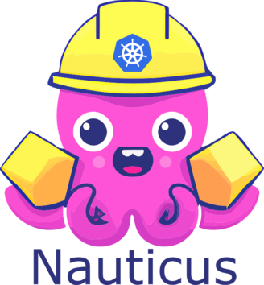

# Nauticus

  

Join the community on the [#nauticus](https://kubernetes.slack.com/archives/C04NQTC3R0F) channel in the [Kubernetes Slack](https://slack.k8s.io/).

---

__Nauticus__ is an open-source Kubernetes controller that simplifies the management of Kubernetes clusters by allowing users to create and manage "Spaces" within the cluster. A Space is a fully-managed Kubernetes namespace that includes RBAC, network policies, resources quotas, and cloud provider specific bindings.

The Nauticus Controller provides an easy-to-use interface that allows users to create and manage Spaces through the Kubernetes API. This means that users can use the same Kubernetes resources to define the desired state of their Spaces and the controller will ensure that the actual state of the Spaces matches the desired state. This declarative approach to managing Spaces makes it easy for users to understand and troubleshoot their cluster.

For detailed [documentation](https://nauticus.edixos.com), please refer to our official documentation.
