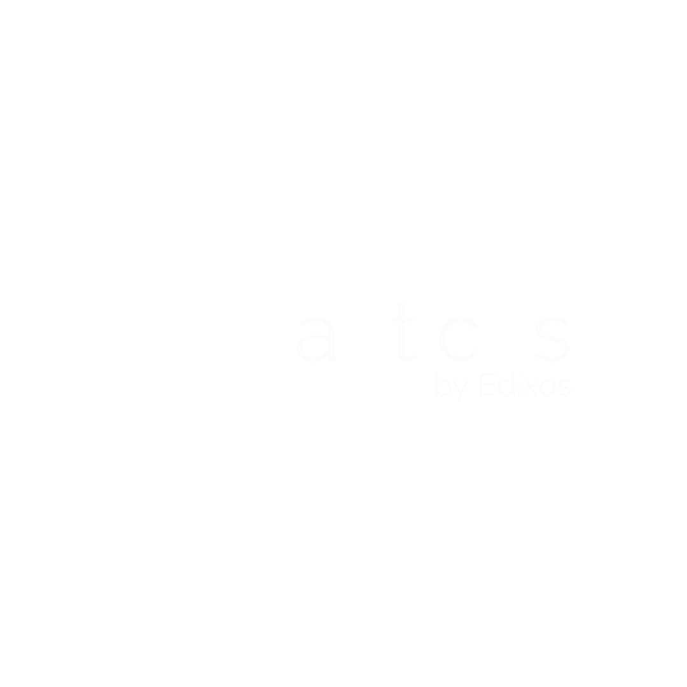

# Nauticus

  

---

__Nauticus__ is an open-source Kubernetes controller that simplifies the management of Kubernetes clusters by allowing users to create and manage "Spaces" within the cluster. A Space is a fully-managed Kubernetes namespace that includes RBAC, network policies, resources quotas, and cloud provider specific bindings.

The Nauticus Controller provides an easy-to-use interface that allows users to create and manage Spaces through the Kubernetes API. This means that users can use the same Kubernetes resources to define the desired state of their Spaces and the controller will ensure that the actual state of the Spaces matches the desired state. This declarative approach to managing Spaces makes it easy for users to understand and troubleshoot their cluster.

For detailed [documentation](https://edixos.github.io/nauticus), please refer to our official documentation.

## Status

The Nauticus Controller is currently under development. This means that the controller is functional, but it may not yet be fully tested, and there may be bugs or unfinished features.

We are actively working on improving and expanding the capabilities of the controller, and we welcome contributions from the community. If you're interested in contributing, please take a look at our contribution guide for more information on how to get involved.

Please also keep in mind that as the controller is under development, the API may change, and backward compatibility may not be guaranteed. We will do our best to minimize breaking changes, but it's possible that some changes may be necessary as the controller evolves.

We encourage users to test the controller in a non-production environment, and to report any bugs or issues that they encounter. We are committed to making the Nauticus Controller a robust and reliable tool for managing Kubernetes clusters, and we appreciate your feedback and support as we work towards this goal.