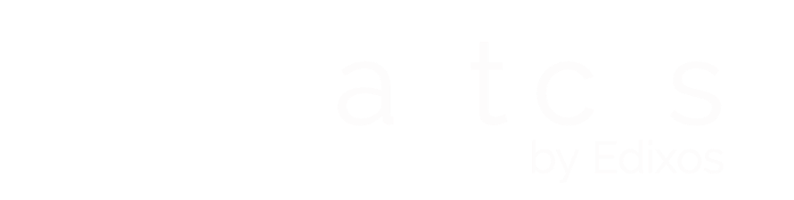
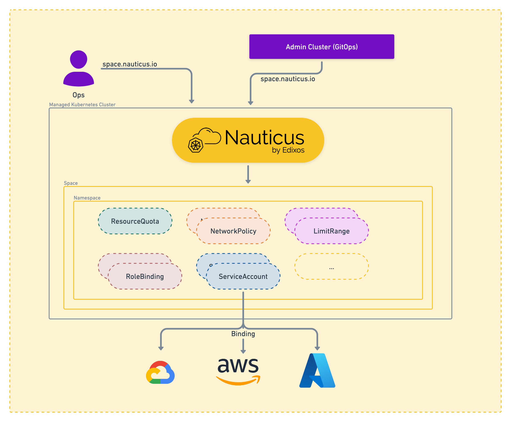

# Nauticus

Welcome to Nauticus, the Kubernetes space management controller. With Nauticus, you can easily create, update, and delete spaces within your Kubernetes cluster. Each space is a unique namespace with its own set of resources and quotas, making it ideal for multi-tenancy environments.

## Features

- ✅ **Resource Quotas:** Assign resource quotas to each space, ensuring that no one team can consume too many resources.
- ✅ **Network Policies:** Create network policies for each space, restricting ingress communication from other spaces or namespaces.
- ✅ **Space Owners:** Specify the owner(s) of each space, giving them full control over the resources within.
- ✅ **Additional RoleBindings:** Assign additional role bindings to each space, providing fine-grained access control.

## Getting Started

To get started with Nauticus, check out our [installation guide](getting-started.md) and [tutorial](tutorial.md) to learn more about the features and how to use them.

## Contributing

