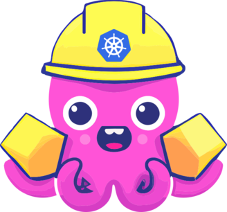
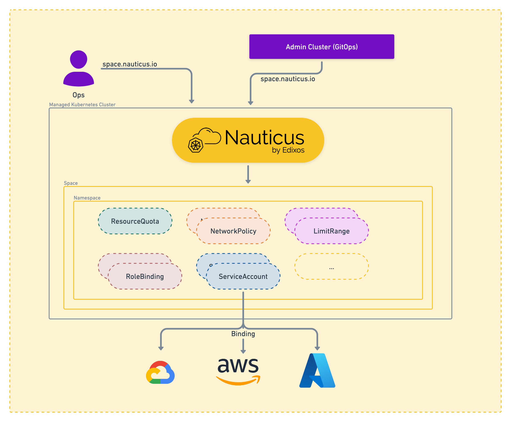

# Nauticus

  

!!! Warning "Project under development"
    The Nauticus Controller is currently under **development**. This means that the controller is functional, but it may not yet be fully tested, and there may be bugs or unfinished features.
    Please also keep in mind that as the controller is under development, the API may change, and backward compatibility may not be guaranteed. We will do our best to minimize breaking changes, but it's possible that some changes may be necessary as the controller evolves.
    We encourage users to test the controller in a **non-production environment**, and to report any bugs or issues that they encounter. We are committed to making the Nauticus Controller a robust and reliable tool for managing Kubernetes clusters, and we appreciate your feedback and support as we work towards this goal.

Welcome to Nauticus, the Kubernetes space management controller. With Nauticus, you can easily create, update, and delete spaces within your Kubernetes cluster. Each space is a unique namespace with its own set of resources and quotas, making it ideal for multi-tenancy environments.

## Features

- ✅ **Resource Quotas:** Assign resource quotas to each space, ensuring that no one team can consume too many resources.
- ✅ **Network Policies:** Create network policies for each space, restricting ingress communication from other spaces or namespaces.
- ✅ **Space Owners:** Specify the owner(s) of each space, giving them full control over the resources within.
- ✅ **Additional RoleBindings:** Assign additional role bindings to each space, providing fine-grained access control.
- ✅ **LimitRanges:** Assign Limit Ranges to each space, providing an additional layer of control over resource utilization in the cluster.
- ✅ **ServiceAccounts:** Create Kubernetes Service Accounts to act as a Cloud Provider Service Account.

## Getting Started

To get started with Nauticus, check out our [installation guide](getting-started.md) and [tutorial](tutorial.md) to learn more about the features and how to use them.
